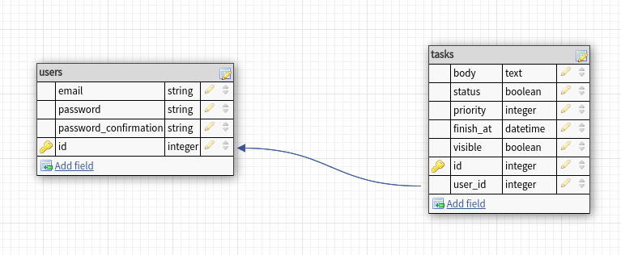

# README

Aplicação para o teste de Desenvolvedor Ruby na empresa HubTec 2019.

## Descrição do teste

Desenvolver um web app em que usuários possam gerenciar tarefas: criar, editar, atualizar e apagar (soft delete). Cada tarefa poderá ter uma data de entrega associada. As tarefas deverão ser privadas, portanto outros usuários não poderão ter acesso.

Web App

Requisitos Obrigatórios:

O web app precisará ser feito com Ruby on Rails (> Rails 5.2.x)

Estrutura:

Rails MVC + Jquery

ou Rails API + React

A interface deverá ser simples e direta.

Testes com RSpec. Tente cobrir o maior escopo possível.

Requisitos Não Obrigatórios:

Dockerizar

### O que iremos avaliar

Sua capacidade de resolver o problema acima

Sua experiência com web apps e chamadas assíncronas

Sua experiência com a stack utilizada ("MVC + JQuery" ou "API + React")

Test Coverage (Relevância e Cobertura)

Escrita do código (Code Convention, Legibilidade)

Estrutura de dados (Relacionamentos)

Escrita de commits (Como você se expressa através dos commits. Usa alguma convenção?)

### O que iremos receber

Código em repositório aberto GIT (Github/Bitbucket)

Projeto funcionando em Plataforma Cloud (Heroku/AWS)

README do projeto com descrição e principais tomadas de decisão. Além de instruções para executar o seu projeto

## Solução

### Dependências

```
ruby 2.6.3

postgresql

nodejs v10 +

```

### Configuração

1 - Altere o database.yml para suas configuração de base

2 - Crie a base

```
rails db:setup
```

3 - Rode as migrations

```
rails db:migrate
```

4 - Crie um usuário

```
rails c
```

```
User.create(email: "example@example.com", password: "xxxxxx", password_confirmation: "xxxxxx")
```

5 - Rode os seeders

```
rails db:seed
```

### Testes

1 - A aplicação foi desenvolvida utilizando rspec

```
bundle exec rspec
```

### Base de dados


